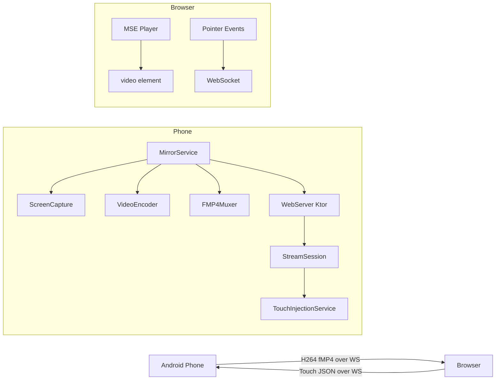

# SCRCPY-Web

[](LICENSE)
[](https://github.com/CrowKing63/scrcpy-web/releases)

Mirror and control your Android screen from any browser over local Wi-Fi — no PC required.


*Designed for Apple Vision Pro Safari (Spatial Display)*

---

## Recent Highlights (v2.3.0)

- **Mac/Linux Guided Installer**: New `install.sh` script with Mac ADB binaries for one-click setup.
- **Samsung One UI Support**: Accessibility service now automatically handles complex multi-step "Full Screen" capture dialogs on Galaxy devices.
- **Stable Mirroring**: Fixed initialization race conditions (black screen fix) and improved frame synchronization.
- **Configurable Port**: Specify your custom server port in the app settings.

---

## Features

- **Zero-PC streaming** — runs entirely on your Android phone
- **H264 + fMP4 over WebSocket** — low-latency MSE playback in Safari
- **Touch control** — tap, swipe, scroll forwarded from browser to phone
- **Navigation buttons** — Back, Home, Recents, Volume, Power
- **Auto-start on boot** — server starts automatically after reboot
- **Dark glassmorphism UI** — optimised for Vision Pro's spatial display
- **Configurable** — resolution, bitrate, and FPS adjustable in-browser

---

## Architecture



---

## Requirements

- Android 10+ (API 29+)
- Local Wi-Fi network
- Browser with MSE + H264 support (Safari visionOS, Chrome, Edge, Firefox)

---

## Installation

### Guided Installer (Recommended)

No ADB knowledge required — the installer guides you step by step.

**Windows**:
1. Download `scrcpy-web-vX.Y.Z-windows-installer.zip` from [Releases](../../releases).
2. Extract and double-click **`install.bat`**.

**macOS / Linux**:
1. Download `scrcpy-web-vX.Y.Z-macos-installer.zip` from [Releases](../../releases).
2. Extract, open Terminal in the folder, and run: `chmod +x install.sh && ./install.sh`.

> Supports: English, Korean, Japanese, Chinese, Spanish.
> Requires Android 11+ for wireless debugging. No USB cable needed.

### Manual Install (Advanced)

See [docs/installation.md](docs/installation.md) for manual ADB instructions and troubleshooting.

---

## Quick Start

After installing the APK:

1. **Grant permissions** in the SCRCPY-Web app:
   - Tap **Grant Screen Capture Permission** → Allow
   - Tap **Enable Accessibility Service** → find SCRCPY-Web → toggle on
2. **Open browser** on another device on the same Wi-Fi and navigate to the IP shown in the app (e.g. `http://192.168.1.42:8080`)

---

## Build from Source

```bash
# Prerequisites: JDK 17, Android SDK with API 36

git clone https://github.com/your-username/scrcpy-web.git
cd scrcpy-web

# Debug build
./gradlew assembleDebug

# Install on connected device
./gradlew installDebug

# Release build
./gradlew assembleRelease
```

---

## Configuration

Settings are accessible via the gear icon in the browser UI or the sliders in the Android app:

| Setting | Range | Default |
|---------|-------|---------|
| Resolution Scale | 25% – 100% | 75% |
| Bitrate | 1 – 8 Mbps | 4 Mbps |
| Max FPS | 15 – 60 | 30 |

---

## Supported Browsers

| Browser | Platform | Notes |
|---------|----------|-------|
| Safari | visionOS (Apple Vision Pro) | Primary target |
| Safari | iOS / macOS | Supported |
| Chrome | Android / Desktop | Supported |
| Edge | Desktop | Supported |
| Firefox | Desktop | Supported |

---

## Known Limitations

- **MediaProjection re-auth on reboot**: After the phone reboots, you must tap "Allow" once in the system dialog. This is an Android OS security requirement and cannot be bypassed.
- **Screen rotation**: Restarting capture is required when the screen orientation changes.
- **Single-user**: The server currently serves one screen capture session. Multiple browsers can view simultaneously, but only one capture stream runs at a time.

---

## Contributing

See [CONTRIBUTING.md](CONTRIBUTING.md) for build instructions, code style, and how to add translations.

---

## License

Apache License 2.0 — see [LICENSE](LICENSE) for details.
